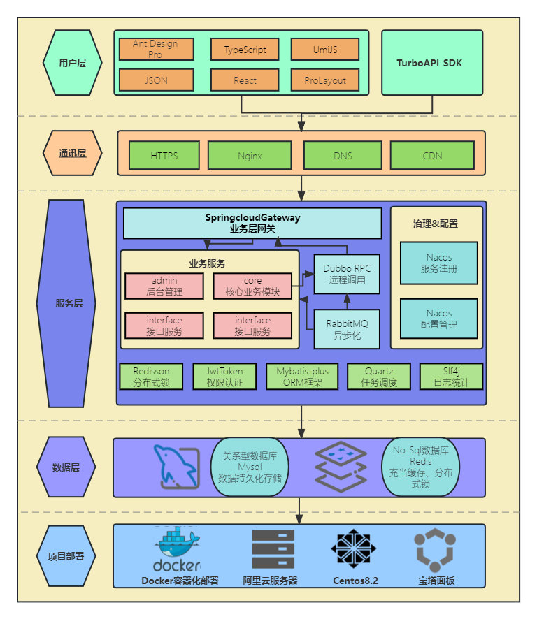
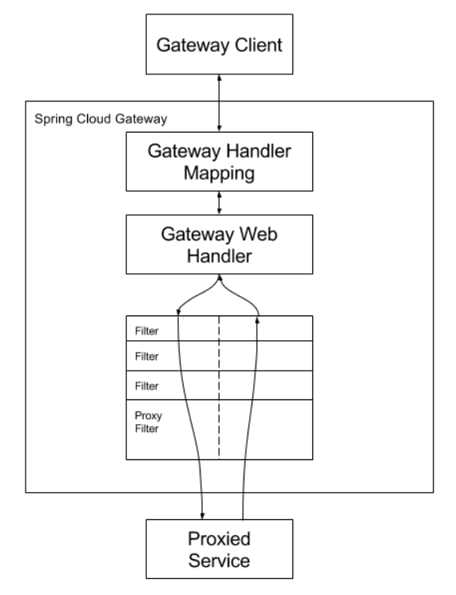
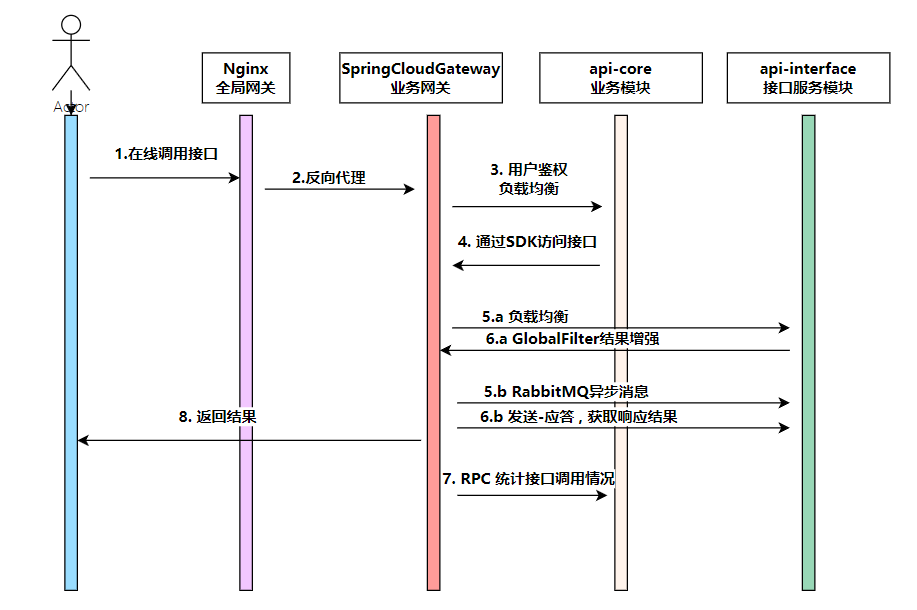
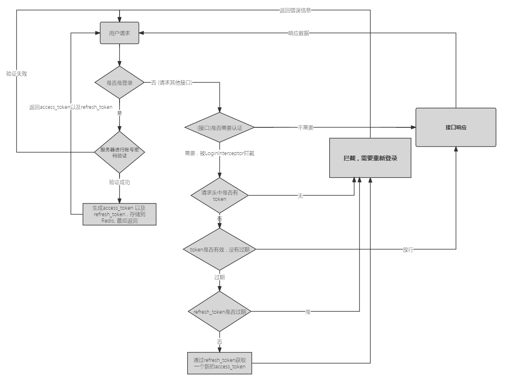

# TurboAPI

## 项目简介

「TurboAPI」是一款高效、可靠和安全的接口开放平台，为广大用户提供高质量、可靠、安全的接口服务，帮助用户轻松实现各种功能和数据交互，提高工作效率和用户体验。我们致力于通过高端的技术和优质的服务，为您的业务发展提供坚实的支持和保障。

本项目为**前后端分离项目**，前端主要采用TypeScript、React、Antd Pro等主流开发框架。后端采用Spring Boot作为基本脚手架。为了实现流量控制、负载均衡以及路由管理，Springcloud Gateway作为全局网关,  使用Mybatis-plus作为持久层技术。为了保证接口服务的高效性和可靠性，使用Apache Dubbo做**高性能远程服务调用**，使用RabbitMQ分布式消息队列进行流量削峰 ,  充分保证服务可用性。同时Nacos作为注册中心，完成服务注册与发现，通过各模块主要功能以及业务进行模块的合理划分。

## 技术介绍

项目中使用到的开源技术

后端

springboot、Springcloud Gateway、Dubbo、MySQL、Mybatis-plus、Redis、Docker、Redisson

前端

AntDesign Pro、React、UmiJS

为使得用户更加快速，方便的调用接口，本项目为使用者提供了**客户端SDK**，用户通过引入依赖，只需一行代码即可完成接口服务的调用。

选用Spring Cloud Gateway作为API网关，实现了路由转发、访问控制、流量染色，并集中处理签名校验，请求参数校验、接口调用统计等业务逻辑，提高安全性的同时、便于系统开发维护。

通过SDK以及网关实现用户在线调用接口。

为了充分保证用户调用以及数据的安全性，前后端使用**跨域身份验证协议JWT**作为权限认证。同时为用户分配AccessKey以及SecretKey，通过MD5单向加密算法以及时间戳、次数、签名等信息保证用户数据安全。

## 快速部署

本项目前后端均使用docker进行镜像构建以及部署。

### 前端安装

前端安装分为四个步骤:1. 打包；2.编写Dockerfile；3.构建镜像；4.运行容器

**打包**

进入到源代码目录，输入NPM RUN BUILD，得到dist目录，即为项目打包出的静态文件



**编写Dockerfile**

通过环境需求以及运行项目需要的操作、开放端口、执行指令等需求来确定Dockerfile文件的内容。（如果您有别的需求,可以在下面示例的基础上进行添加或修改）

**构建镜像**

我们把DIST目录以及Dockerfile文件上传到服务器，通过docker build 命令来进行镜像的构建。

**运行容器**

通过我们构建好的镜像搭配docker run来进行容器的创建以及运行。根据图3的镜像,使用下述指令进行容器运行

**docker run -d -p 8000:8000 –name api-frontend api-frontend:v1**

### 后端安装

后端安装分为四个步骤:1. 打包；2.编写Dockerfile；3.构建镜像；4.运行容器

**打包**

打包以生成项目可执行的jar包，由于本项目根据业务功能进行了模块划分，这里为方便起见使用InteliJ IDEA 进行项目打包。

如果您想要通过maven命令进行打包，可直接运行mvn clean install 命令进行打包。

项目打包成功后，可以在每个模块的target目录下看到相应的jar包。



**编写Dockerfile**

后端每个模块使用的Dockerfile区别在于模块名以及项目的运行端口，因此这里以网关模块为例，展示Dockerfile文件的相关内容

**构建镜像**

我们把jar以及Dockerfile文件上传到服务器，通过docker build 命令来进行镜像的构建。为了方便起见，本团队以模块名标记Dockerfile文件，同时把项目生成的jar包统一放到**/docker/jar**目录中

通过docker build命令进行镜像构建:

**docker build -t api-core:v1 -f Dockerfile-core . ;**

**docker build -t api-interface:v1 -f Dockerfile-interface . ;**

**docker build -t api-gateway:v1 -f Dockerfile-gateway . ;**

**运行容器**

通过我们构建好的镜像搭配docker run来进行容器的创建以及运行。根据图3的镜像,使用下述指令运行容器：

**docker run -d -p 9001:9001 --name core api-core:v1 ;**

**docker run -d -p 88:88 --name gateway api-gateway:v1 ;**

**docker run -d -p 8123:8123 --name interface api-interface:v1 ;**
