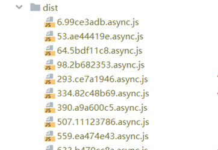
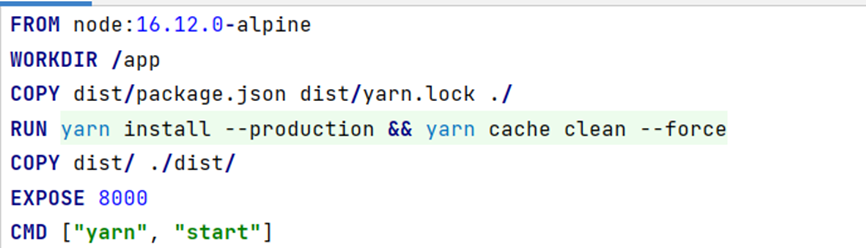
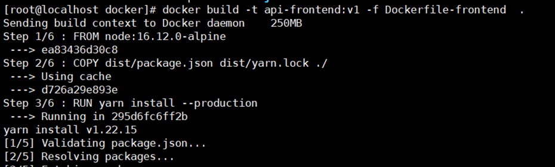
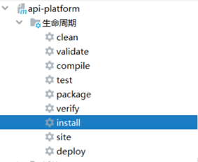
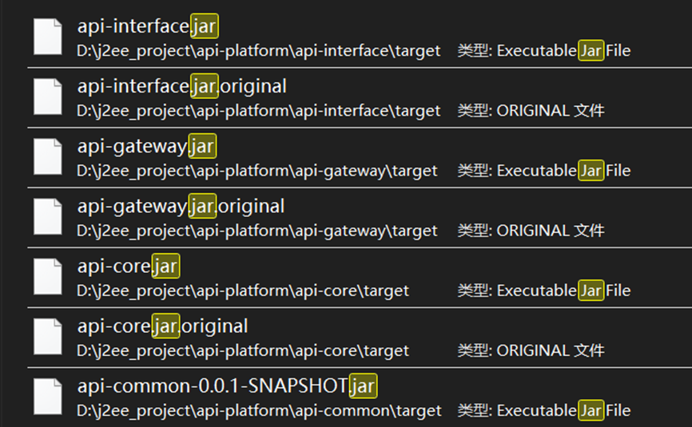
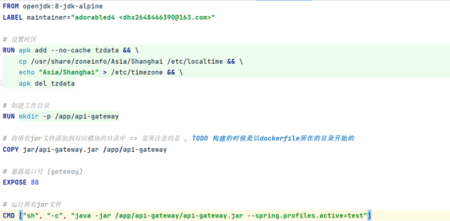
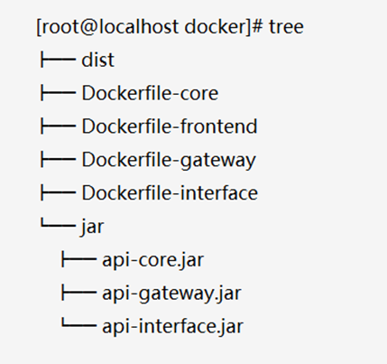
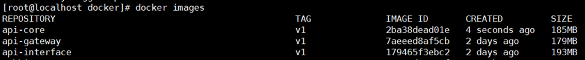

# TurboAPI

## 项目简介

「TurboAPI」是一款高效、可靠和安全的接口开放平台，为广大用户提供高质量、可靠、安全的接口服务，帮助用户轻松实现各种功能和数据交互，提高工作效率和用户体验。

本项目为**前后端分离项目**，前端主要采用TypeScript、React、Antd Pro等主流开发框架。后端采用Spring Cloud SpringBoot 作为业务框架。通过Springcloud Gateway作为全局网关实现流量控制、负载均衡以及路由管理，使用Mybatis-plus作为持久层技术。使用Apache Dubbo做**高性能远程服务调用**。同时Nacos作为注册中心，完成服务注册与发现，通过各模块主要功能以及业务进行模块的合理划分。通过全链路日志以及回调配置, 支持**异步接口调用** , 同时通过**FreeMarker模板引擎**进行自动化**SDK代码以及接口文档生成** , 并通过**Github Action完成SDK发版与接口文档部署。**

**主要开源组件与版本**

| **item**         | **version**    |
| ---------------- | -------------- |
| **JDK**          | **17**         |
| **SpringBoot**   | **2.7.9**      |
| **SpringCloud**  | **2021.0.7.0** |
| **Apache Dubbo** | **3.1.6**      |
| **OpenAPI**      | **3**          |
| **MySQL**        | **5.7**        |
| **Redis**        | **6.2**        |
| **Mybatis-Plus** | **3.5.2**      |
| **Nacos**        | **2.2.1**      |
| **FreeMarker**   | **2.3.2**      |

关于版本说明 , 项目开发时使用是JDK17, 同时完美支持JDK1.8 

> 实测 **JDK17**下启动速度效果更好, 建议使用JDK17

### 项目架构图: 


## 主要功能说明

### 发布接口

接口表根据易变信息分成了两个表 : `interface_info` 以及 `interface_variable_info` 

**结构如下**: 

前者主要是接口的基本信息,  后者主要包含 **示例** , **请求元信息** 以及SDK生成需要的信息。 

```sql
-- ----------------------------
-- Table structure for interface_info
-- ----------------------------
DROP TABLE IF EXISTS `interface_info`;
CREATE TABLE `interface_info`  (
  `id` bigint(20) NOT NULL AUTO_INCREMENT COMMENT '接口id',
  `name` varchar(64) CHARACTER SET utf8mb4 COLLATE utf8mb4_general_ci NOT NULL COMMENT '接口名称',
  `cost` int(11) NULL DEFAULT 1 COMMENT '消耗硬币数',
  `description` varchar(512) CHARACTER SET utf8mb4 COLLATE utf8mb4_general_ci NULL DEFAULT NULL COMMENT '接口描述',
  `image_url` varchar(128) CHARACTER SET utf8mb4 COLLATE utf8mb4_general_ci NULL DEFAULT NULL COMMENT '接口图片',
  `category_bit_map` bigint(20) NOT NULL COMMENT '接口分类',
  `status` tinyint(4) NULL DEFAULT NULL COMMENT '接口状态',
  `is_async` tinyint(4) NOT NULL DEFAULT 0 COMMENT '是否是异步API',
  `doc_url` varchar(255) CHARACTER SET utf8mb4 COLLATE utf8mb4_general_ci NULL DEFAULT NULL COMMENT '接口文档地址',
  `request_method` varchar(12) CHARACTER SET utf8mb4 COLLATE utf8mb4_general_ci NULL DEFAULT NULL COMMENT '请求方式',
  `create_time` timestamp NOT NULL DEFAULT CURRENT_TIMESTAMP COMMENT '创建时间',
  `update_time` timestamp NOT NULL DEFAULT CURRENT_TIMESTAMP ON UPDATE CURRENT_TIMESTAMP COMMENT '更新时间',
  `is_deleted` tinyint(4) NULL DEFAULT 0 COMMENT '逻辑删除字段',
  PRIMARY KEY (`id`, `category_bit_map`) USING BTREE
) ENGINE = InnoDB AUTO_INCREMENT = 34 CHARACTER SET = utf8mb4 COLLATE = utf8mb4_general_ci ROW_FORMAT = Dynamic;

-- ----------------------------
-- Table structure for interface_variable_info
-- ----------------------------
DROP TABLE IF EXISTS `interface_variable_info`;
CREATE TABLE `interface_variable_info`  (
  `id` bigint(20) NOT NULL AUTO_INCREMENT COMMENT '接口ID',
  `request_param` varchar(512) CHARACTER SET utf8mb4 COLLATE utf8mb4_general_ci NULL DEFAULT NULL COMMENT '请求参数',
  `request_headers` varchar(512) CHARACTER SET utf8mb4 COLLATE utf8mb4_general_ci NULL DEFAULT NULL COMMENT '请求头',
  `request_example` varchar(512) CHARACTER SET utf8mb4 COLLATE utf8mb4_general_ci NULL DEFAULT NULL COMMENT '请求示例',
  `response_example` text CHARACTER SET utf8mb4 COLLATE utf8mb4_general_ci NULL COMMENT '响应示例',
  `total_call_count` bigint(20) NULL DEFAULT 0 COMMENT '总调用次数',
  `call_path` varchar(255) CHARACTER SET utf8mb4 COLLATE utf8mb4_general_ci NOT NULL COMMENT '调用路径',
  `sdk_method_name` varchar(128) CHARACTER SET utf8mb4 COLLATE utf8mb4_general_ci NULL DEFAULT NULL COMMENT 'SDK中的方法名称',
  `model_name` varchar(255) CHARACTER SET utf8mb4 COLLATE utf8mb4_general_ci NULL DEFAULT NULL COMMENT '响应结果对应的实体类的名称',
  `sdk_param_name` varchar(128) CHARACTER SET utf8mb4 COLLATE utf8mb4_general_ci NULL DEFAULT NULL COMMENT 'SDK中的参数名称',
  `service_address` varchar(128) CHARACTER SET utf8mb4 COLLATE utf8mb4_general_ci NULL DEFAULT NULL COMMENT '服务地址',
  `create_time` timestamp NOT NULL DEFAULT CURRENT_TIMESTAMP COMMENT '创建时间',
  `update_time` timestamp NOT NULL DEFAULT CURRENT_TIMESTAMP ON UPDATE CURRENT_TIMESTAMP COMMENT '更新时间',
  `is_deleted` tinyint(4) NULL DEFAULT 0 COMMENT '逻辑删除字段',
  PRIMARY KEY (`id`) USING BTREE
) ENGINE = InnoDB AUTO_INCREMENT = 34 CHARACTER SET = utf8mb4 COLLATE = utf8mb4_general_ci ROW_FORMAT = Dynamic;
```

对于发布接口 ， 流程是

1. 确定入参 以及 返回结果 => 添加到 api-common 的 `com.dhx.apicommon.model` 中 (**接口功能, 入参 , 出参设计**)
2. **开发功能** , v** 的接口版本需要区分清楚
3. **进行功能测试**
4. 调用api-core接口（访问 `http://localhost:88/doc.html#/api-core/interface%E6%8E%A7%E5%88%B6%E5%B1%82/publishInterface`）, 添加 **接口元信息**
5. 手动 / 自动 **生成SDK 代码以及接口Markdown文档**
6. **GithubAction** 执行CI/CD , 完成SDK发版

**发布接口的示例参数如下**

```json
{
    "name": "在线判题API",
    "description": "判题API,输入代码以及输入(input), 返回程序运行结果以及消耗内存,运行时间等信息。(测试期间,目前仅支持Java)",
    "imageUrl": "http://dhx-blog.oss-cn-beijing.aliyuncs.com/dhx/oj.png",
    "categories": ["数据智能","应用开发","限时免费"],
    "status": "可用",
    "mockCategoryEnum": "数据智能",
    "docUrl": "https://turboapi-doc.dhx.icu/docs/v2/在线判题API",
    "requestMethod": "POST",
    "requestParam": "{`code`:`string`,`input`:`string[]`,`language`:`string`}",
    "requestHeaders": "content-type:application/json",
    "callPath": "api/v3/judge/java",
    "serviceAddress": "http://turboapi.dhx.icu",
    "isAigc": false,
    "sdkMethodName": "callOJ",
    "sdkParamName": "com.dhx.apicommon.model.v2.param.OJParam",
    "version": "v2",
    "modelName": "java.lang.Object",
    "isAsync": true
}
```

### SDK代码生成

> 详细内容可以参考 : [TurboAPI-SDK自动生成技术与代码实践](https://blog.dhx.icu/2023/12/springboot/FreeMarker%20SDK%E4%BB%A3%E7%A0%81%E8%87%AA%E5%8A%A8%E5%8C%96%E7%94%9F%E6%88%90/)

**大致的流程上是** : **监听接口元数据 -> 触发hook -> 执行代码生成 -> 更新到代码仓库 -> 自动化测试 -> CI/CD -> 完成发版**

主要强调三个问题 : 

1. **ftl 的缩进问题**
2. **接口元信息** (通过上面的表设计已经解决, 这里简单解释)
3. **FreeMarker**的基本语法。
4. **相对路径问题**

#### 缩进问题

关于缩进 ， **ftl文件中是不能包含任何的空格以及制表符的（除了 标签 携带的制表符）**

这就会导致生成的代码没有任何格式, 可读性极差。

比如： 

```java
public class ${className} {

public ${api.modelName} ${api.methodName}() {
try {
String nowTime = new SimpleDateFormat("yyyy-MM-dd hh:mm:ss").format(new Date());
String result = HttpRequest.get(SERVER_HOST + "${callPath}").addHeaders(getHeaderMap()).execute().body();
BaseResponse baseResponse = JSONUtil.toBean(result, BaseResponse.class);
if (baseResponse.getCode() == 200) {
String dataStr = JSONUtil.toJsonStr(baseResponse.getData());
if (dataStr == null || dataStr.equals("")) {
log.error("\u001B[31m" + e.getClass() + "\u001B[0m: " + "[HxApiClient] 调用接口失败 --" + baseResponse.toString());
}
${basePackage}.model.${api.modelName} obj = JSONUtil.toBean(dataStr, ${basePackage}.model.${api.modelName}.class);
return obj;
} else {
throw new BusinessException(baseResponse.getCode(), baseResponse.getMessage());
}
} catch (IORuntimeException e) {
log.error("\u001B[31m" + e.getClass() + "\u001B[0m: " + "[HxApiClient] 访问服务器失败 --" + e.getMessage());
} catch (RuntimeException e) {
log.error("\u001B[31m" + e.getClass() + "\u001B[0m: " + "[HxApiClient] 调用接口失败 --" + e.getMessage());
}
}
}
```

解决办法是准备一个FileUtil, 对ftl文件进行格式化处理, 生成对应的制表符即可。

```ftl
public class ${className} {
${"\t"}@Slf4j
${"\t"}public ${basePackage}.model.${modelName} ${methodName}() {
${"\t"}${"\t"}try {
${"\t"}${"\t"}${"\t"}String nowTime = new SimpleDateFormat("yyyy-MM-dd hh:mm:ss").format(new Date());
${"\t"}${"\t"}${"\t"}String result = HttpRequest.get(SERVER_HOST + "${callPath}").addHeaders(getHeaderMap()).execute().body();
${"\t"}${"\t"}${"\t"}BaseResponse baseResponse = JSONUtil.toBean(result, BaseResponse.class);
${"\t"}${"\t"}${"\t"}if (baseResponse.getCode() == 200) {
${"\t"}${"\t"}${"\t"}${"\t"}String dataStr = JSONUtil.toJsonStr(baseResponse.getData());
${"\t"}${"\t"}${"\t"}${"\t"}if (dataStr == null || dataStr.equals("")) {
${"\t"}${"\t"}${"\t"}${"\t"}${"\t"}log.error("\u001B[31m" + e.getClass() + "\u001B[0m: " + "[HxApiClient] 调用接口失败 --" + baseResponse.toString());
${"\t"}${"\t"}${"\t"}${"\t"}}
${"\t"}${"\t"}${"\t"}${"\t"}${basePackage}.model.${modelName} obj = JSONUtil.toBean(dataStr, ${basePackage}.model.${modelName}.class);
${"\t"}${"\t"}${"\t"}${"\t"}return obj;
${"\t"}${"\t"}${"\t"}} else {
${"\t"}${"\t"}${"\t"}${"\t"}throw new BusinessException(baseResponse.getCode(), baseResponse.getMessage());
${"\t"}${"\t"}${"\t"}}
${"\t"}${"\t"}} catch (IORuntimeException e) {
${"\t"}${"\t"}${"\t"}log.error("\u001B[31m" + e.getClass() + "\u001B[0m: " + "[HxApiClient] 访问服务器失败 --" + e.getMessage());
${"\t"}${"\t"}} catch (RuntimeException e) {
${"\t"}${"\t"}${"\t"}log.error("\u001B[31m" + e.getClass() + "\u001B[0m: " + "[HxApiClient] 调用接口失败 --" + e.getMessage());
${"\t"}${"\t"}}
${"\t"}}
}
```

具体的操作就是

1. 读取文件
2. 操作字符串
3. 写文件(写到新的ftl文件中)

> 这里的debug还是非常痛苦的, 好在顺利完成了。

#### 接口元信息

为了简化SDK代码的生成， 统一通过设定类来规定一个接口的入参， 具体可以参考`com.dhx.apicommon.model.vXXX`下的类 

在 接口信息表中, 我们通过写入全类名 , 即可完成顺利完成代码的生成

**比如**

```ftl
public com.dhx.common.model.v1.Poet1 getWeather1(com.dhx.common.model.v1.query.PoetQuery param) {
}
```

#### meta-data维护

关于接口的meta-data, 有

- basePackage
- className(ApiClient)
- apis: 
  - name
  - description
  - callPath
  - serviceAddress
  - requestParam
  - requestMethod
  - requestHeaders
  - sdkMethodName
  - sdkParamName
  - imageUrl
  - version
  - requestExample
  - responseExample
  - docUrl
  - status
  - categories

#### FreeMarker基本语法

掌握基本的if-else , list 以及 **判空** 操作即可

### 全链路日志

对于**分布式系统**或者是**微服务项目**, 常常会出现多个服务之间互相调用的情况, 对于单体项目的日志, 我们是难以进行错误排查的

全链路日志是指记录了一个请求/事务在整个系统中经过的所有组件、服务和节点的日志信息。

这包括了请求在系统中的调用、处理、传输、响应等环节的详细日志。

全链路日志可以帮助定位分布式系统中的故障或问题，通过查看全链路日志，可以清晰地了解请求在系统中的流转情况，从而更容易发现故障发生的位置和原因。

- 对于请求 :  从网关路由到某个模块, 此时需要网关创建`trace_id`,  然后通过配置日志文件打印相关内容

- 对于RPC : 需要通过**RpcContext**来传播相关的`trace_id` , 注意Dubbo这里的配置是有点复杂的

  1. 实现接口 `org.apache.dubbo.rpc.Filter`
  2. 在resource下添加 `META-INF/dubbo` 目录下添加 `org.apache.dubbo.rpc.Filter` 文件 
  3. 在文件中 输入 `traceId=com.dhx.apicore.aop.RemoteTraceIdFilter `的配置内容

  假设我们有A , B , C三个服务, 完全会出现 A调用B , B接着调用C, C反过来需要调用A的场景 , 如果是三体项目, 这里的ABC可能就是三个模块, 调用的关系就是 xxxService 互相调用, 不考虑异步的问题, 日志中打印的线程信息即可满足我们查找日志的需求。

  但是如果是微服务项目， 就需要我们手动去设置Filter ，在服务调用前/后 进行相应的处理(这里就是`MDC.out(TRACE_ID, traceId))`

**网关过滤器生成traceId**

```java
@Override
public Mono<Void> filter(ServerWebExchange exchange, GatewayFilterChain chain) {
    ServerHttpRequest request = exchange.getRequest();
    ServerHttpResponse response = exchange.getResponse();
    //对请求对象request进行增强
    ServerHttpRequest req = request.mutate().headers(httpHeaders -> {
        //httpHeaders 封装了所有的请求头
        String traceId = UUID.randomUUID().toString(true);
        MDC.put(TRACE_ID, traceId);
        httpHeaders.set(TRACE_ID, traceId);
        // dubbo context
        RpcContext.getClientAttachment().setAttachment(TRACE_ID,traceId);
    }).build();
    //设置增强的request到exchange对象中
    exchange.mutate().request(req);
    String url = request.getURI().getPath();
    log.info("接收到请求：{}", url);
    // 跨域放行
    if (request.getMethod() == HttpMethod.OPTIONS) {
        response.setStatusCode(HttpStatus.OK);
        return Mono.empty();
    }
    return chain.filter(exchange);
}
```

**Dubbo过滤器(上下文配置)**

```java
@Activate(group = {CommonConstants.CONSUMER, CommonConstants.PROVIDER}, order = -30000)
@Slf4j
public class RemoteTraceIdFilter implements Filter {
    private static final String TRACE_ID = "traceId";

    @Override
    public Result invoke(Invoker<?> invoker, Invocation invocation) throws RpcException {
        // 消费者
        if (RpcContext.getCurrentServiceContext().isConsumerSide()) {
            String traceId = MDC.get(TRACE_ID);
            if(traceId==null){
                traceId = UUID.randomUUID().toString();
            }
            //消费者 将trace_id（业务流水号） set至上下文中
            RpcContext.getClientAttachment().setAttachment(TRACE_ID, traceId);
        } else {
            // 服务提供者
            String traceId = RpcContext.getClientAttachment().getAttachment(TRACE_ID);
            if (traceId == null) {
                traceId = UUID.randomUUID().toString();
            }
            //slf4j 中设置了日志打印格式用作日志链路追踪
            MDC.put(TRACE_ID, traceId);
        }
        try {
            return invoker.invoke(invocation);
        } finally {
            if (RpcContext.getCurrentServiceContext().isProviderSide()) {
                MDC.remove(TRACE_ID);
            }
        }
    }
}
```

### 异步调用接口

对于支付 , 异步审核等等接口, 请求都是异步的, 往往响应给我们的只是 一个**trace_id**, 然后接收异步消息来完成接口的调用。

那么我们的API开放平台平台也可以考虑做异步的接口.

基本的设想是: 

1. 添加 **call_result** 表存储异步接口的执行结果 , 用户可以后续可以进行查询
2. 添加**trace_id** 用来定位每次调用接口 (同时可以通过日志设置trace_id 来进行**全链路日志追踪**)
3. 添加 **call_back** 来存储用户对于每个接口的回调路径 . 


**call_result**

> 调用结果的信息可能会非常庞大, 因此是**不能对此内容进行持久化存储的**

| column       | type         | comment                      |
| ------------ | ------------ | ---------------------------- |
| id           | bigint       | 主键, 自增                   |
| interface_id | bigint       | 接口ID                       |
| user_id      | bigint       | 用户ID                       |
| trace_id     | varchar(128) | trace_id, 用来标记每次的请求 |
| is_async     | tinyint      | 是否是异步调用               |
| status       | tinyint      | 本次调用执行状态             |
| create_time  | timestamp    | 创建时间                     |
| is_delete    | tinyint      | 逻辑删除, 默认0              |

**call_back**

| column        | type         | comment                |
| ------------- | ------------ | ---------------------- |
| id            | bigint       | 主键, 自增             |
| interface_id  | bigint       | 接口ID                 |
| user_id       | bigint       | 用户ID                 |
| call_back_url | varchar(512) | 用户绑定的回调接口地址 |
| create_time   | timestamp    | 创建时间               |
| update_time   | timestamp    | 更新时间               |
| is_delete     | tinyint      | 逻辑删除, 默认0        |

上面的流程已经非常清晰,  这里简单陈述RPC与MQ的区别以及主要的场景

**RPC（Remote Procedure Call）：**

- RPC 是一种**通信模式**，用于在不同的计算机之间进行远程调用，就像调用本地方法一样。
- RPC 更适合进行点对点的通信，通常是面向特定服务的调用。
- RPC 调用通常是实时的请求响应模式，调用方需要等待远程服务的返回结果。
- 典型的 RPC 框架有 gRPC、Thrift、Dubbo 等。

**MQ（Message Queue）：**

- MQ 是一种消息传递模式，用于在不同的应用之间异步传递消息。
- MQ 适合处理异步消息和事件驱动的场景，支持广播和订阅模式。
- MQ 可以实现削峰填谷、解耦合、数据持久化、事件驱动等特性。
- 典型的 MQ 系统有 RabbitMQ、Apache Kafka、ActiveMQ 等。

**对比：**

1. **通信模式**：RPC 更适合点对点的实时通信，而 MQ 更适合异步、事件驱动的消息通信。
2. **调用方式**：RPC 是同步阻塞的方式，往往需要等待远程服务的响应，而 MQ 通过异步消息传递的方式提供了更大的灵活性。
3. **解耦合**：MQ 可以提供系统之间的解耦合，降低系统之间的依赖性，RPC 则更多地关注于服务间直接的调用。
4. **消息持久化**：MQ 通常支持消息持久化，可以保证消息在传递过程中的可靠性和持久化。而 RPC 更关注服务之间的直接通信和调用。
5. **广播订阅**：MQ 通常支持广播和订阅模式，可以实现一条消息被多个接收者接收，而 RPC 主要是一对一的直接通信。

**对于这里异步调用接口的场景, 对于实时性的要求并不高, 相反接口服务需要承受较高的并发,  因此MQ的特性更加适合我们的场景**

这里通过RabbitMQ来进行消息传递 , 在api-core模块中设定消息消费者, 当接口服务执行完毕之后 , 发送消息到MQ中 。

**对于一个请求，可以通过一个traceId来完成定位。** 

**同样的， 对于一次接口的调用/执行, 也可以通过 traceId来定位。**

### Docusaus文档+ Github Page建站

> 主打一个简单 , 高效 , 免费(baipiao)

效果预览:  [https://turboapi-doc.dhx.icu/](https://turboapi-doc.dhx.icu/)

官方网站 : https://docusaurus.io/zh-CN/docs/category/guides

详细配置可以参考 : **api-doc目录下内容**

```
set GIT_USER=adorabled4
set USE_SSH=git@github.com:adorabled4/TurboAPI.git
tyarn deploy
```

**效果如下**


### Knife4j文档聚合

启动项目 , 访问`http://localhost:88/doc.html`即可进行查看。

在微服务架构下，每个后台应用都接入[swagger](https://so.csdn.net/so/search?q=swagger&spm=1001.2101.3001.7020) 在线文档，在服务特别多的情况下，就需要做聚合文档处理，也就是将所有服务的文档聚合在一起。

`Spring Cloud Gateway`作为微服务的API网关，可以整合swagger 实现聚合接口文档。

网关配置

```yml
knife4j:
  gateway:
    # ① 第一个配置，开启gateway聚合组件
    enabled: true
    # ② 第二行配置，设置聚合模式采用discover服务发现的模式
    strategy: discover
    discover:
      # ③ 第三行配置，开启discover模式
      enabled: true
      # ④ 第四行配置，聚合子服务全部为Swagger2规范的文档
      version: openapi3
```

微服务配置

```yml
springdoc:
  swagger-ui:
    path: /swagger-ui.html
    tags-sorter: alpha
    operations-sorter: alpha
  api-docs:
    path: /v3/api-docs
  group-configs:
    - group: default
      paths-to-match: '/**'
      packages-to-scan: com.dhx.apicore.controller
knife4j:
  enable: true
  setting:
    language: zh_cn
```

> **需要注意openAPI2 与openAPI3 注解的差别**

### JWT+Redis双token登录

为了充分保证用户调用以及数据的安全性，前后端使用**跨域身份验证协议JWT**作为权限认证。同时为用户分配AccessKey以及SecretKey，通过MD5单向加密算法以及时间戳、次数、签名等信息保证用户数据安全。


## BenchMark

> Driver By jmh

### v1-interface

具体代码参考 `com.dhx.apiinterface.jmh.V1InterfaceBenchmarkTest`

测试信息

```
# Windows 10 @ 5600H
# JMH version: 1.22
# VM version: JDK 17.0.6, Java HotSpot(TM) 64-Bit Server VM, 17.0.6+9-LTS-190
# VM invoker: D:\jdk17_\bin\java.exe
# VM options: -server
# Warmup: 5 iterations, 10 s each
# Measurement: 20 iterations, 10 s each
# Timeout: 120 s per iteration
# Threads: 4 threads, will synchronize iterations
# Benchmark mode: Average time, time/op

Benchmark                                               Mode  Cnt  Score   Error  Units
V1InterfaceBenchmarkTest.anaIpAddressTest               avgt   20  0.533 ± 0.008  ms/op
V1InterfaceBenchmarkTest.getRandomLovelornSentenceTest  avgt   20  2.625 ± 0.032  ms/op
V1InterfaceBenchmarkTest.getRandomPoetTest              avgt   20  1.382 ± 0.016  ms/op
V1InterfaceBenchmarkTest.getSuffixInfoTest              avgt   20  0.909 ± 0.012  ms/op
```


### v2-interface

具体代码参考 `com.dhx.apiinterface.jmh.V2InterfaceBenchmarkTest`

测试信息

```
# Windows 10 @ 5600H
# JMH version: 1.22
# VM version: JDK 17.0.6, Java HotSpot(TM) 64-Bit Server VM, 17.0.6+9-LTS-190
# VM invoker: D:\jdk17_\bin\java.exe
# VM options: -server
# Warmup: 1 iterations, 100 ms each, 10 calls per op
# Measurement: 100 iterations, 1 s each, 10 calls per op
# Timeout: 120 s per iteration
# Threads: 1 thread, will synchronize iterations
# Benchmark mode: Average time, time/op
# Benchmark: com.dhx.apiinterface.jmh.V3InterfaceBenchmarkTest.anaIdiomTest

Benchmark                                              Mode  Cnt   Score   Error  Units
V3InterfaceBenchmarkTest.anaIdiomTest                  avgt  100   5.846 ± 0.123  ms/op
V3InterfaceBenchmarkTest.constellationParamSearchTest  avgt  100   5.958 ± 0.121  ms/op
V3InterfaceBenchmarkTest.jqrcodeTest                   avgt  100  19.609 ± 0.433  ms/op
V3InterfaceBenchmarkTest.locationSearchTest            avgt  100   5.837 ± 0.133  ms/op
```


## 快速部署

本项目前后端均使用docker进行镜像构建以及部署。

### 前端安装

前端安装分为四个步骤:1. 打包；2.编写Dockerfile；3.构建镜像；4.运行容器

**打包**

进入到源代码目录，输入NPM RUN BUILD，得到dist目录，即为项目打包出的静态文件





**编写Dockerfile**

通过环境需求以及运行项目需要的操作、开放端口、执行指令等需求来确定Dockerfile文件的内容。（如果您有别的需求,可以在下面示例的基础上进行添加或修改）



**构建镜像**

我们把DIST目录以及Dockerfile文件上传到服务器，通过docker build 命令来进行镜像的构建。



**运行容器**

通过我们构建好的镜像搭配docker run来进行容器的创建以及运行。根据图3的镜像,使用下述指令进行容器运行

**docker run -d -p 8000:8000 –name api-frontend api-frontend:v1**

### 后端安装

后端安装分为四个步骤:1. 打包；2.编写Dockerfile；3.构建镜像；4.运行容器

**打包**

打包以生成项目可执行的jar包，由于本项目根据业务功能进行了模块划分，这里为方便起见使用InteliJ IDEA 进行项目打包。



如果您想要通过maven命令进行打包，可直接运行mvn clean install 命令进行打包。

项目打包成功后，可以在每个模块的target目录下看到相应的jar包。





**编写Dockerfile**

后端每个模块使用的Dockerfile区别在于模块名以及项目的运行端口，因此这里以网关模块为例，展示Dockerfile文件的相关内容



**构建镜像**

我们把jar以及Dockerfile文件上传到服务器，通过docker build 命令来进行镜像的构建。为了方便起见，本团队以模块名标记Dockerfile文件，同时把项目生成的jar包统一放到**/docker/jar**目录中



通过docker build命令进行镜像构建:

**docker build -t api-core:v1 -f Dockerfile-core . ;**

**docker build -t api-interface:v1 -f Dockerfile-interface . ;**

**docker build -t api-gateway:v1 -f Dockerfile-gateway . ;**



**运行容器**

通过我们构建好的镜像搭配docker run来进行容器的创建以及运行。根据图3的镜像,使用下述指令运行容器：

**docker run -d -p 9001:9001 --name core api-core:v1 ;**

**docker run -d -p 88:88 --name gateway api-gateway:v1 ;**

**docker run -d -p 8123:8123 --name interface api-interface:v1 ;**
